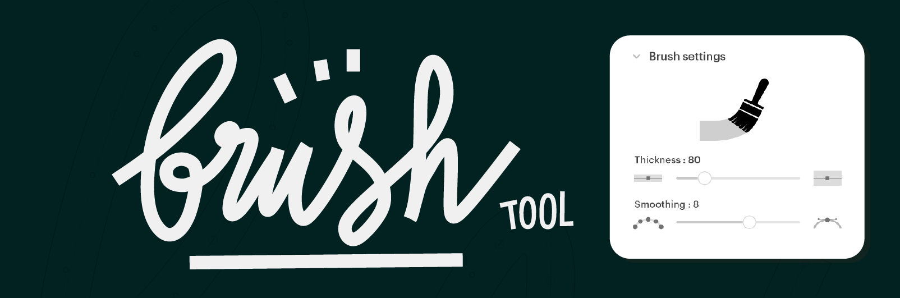
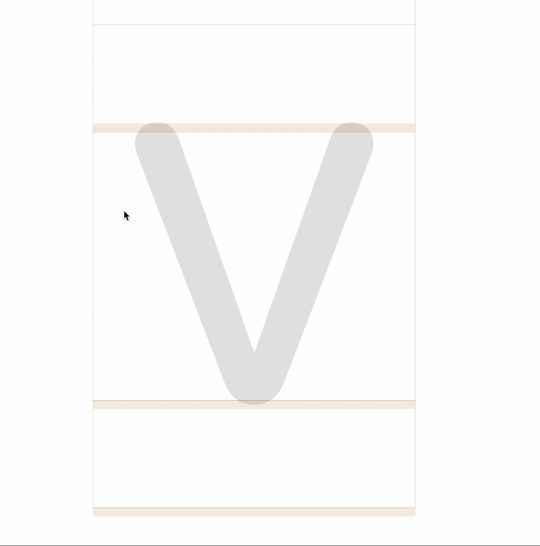
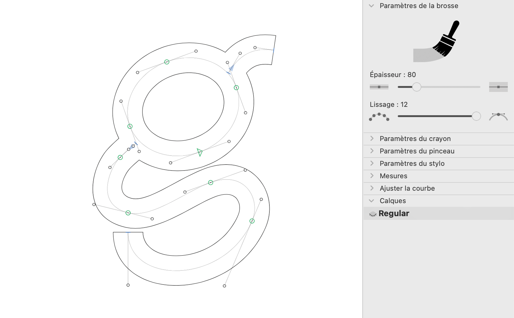

# 🖌️ BrushTool (EN) 

This is a plugin for the [Glyphs font editor](http://glyphsapp.com/) by Georg Seifert.  
It adds a custom **Flat Brush Tool** to Glyphs, providing a broad, fixed-width stroke with sharp, **square endings**.  
The Brush Tool is ideal for calligraphic sketching, brush-inspired lettering, or any typographic work that benefits from a wide, monoline brush texture.  
Stroke **thickness** and **smoothing** can be adjusted through the companion palette.  
After installation, it will appear in the toolbar with a brush icon.

## Installation

1. Download the complete ZIP file and unpack it, or clone the repository.
2. Double click the `.glyphsPlugin` file. Confirm the dialog that appears in Glyphs.
3. Restart Glyphs.

## Usage Instructions

1. Open a glyph in Edit View.
2. Select the **Brush Tool** from the toolbar.
3. Click and drag in the editor to draw freely.

The tool produces **flat, monoline strokes** with square-cut endings, following your movements for clear, calligraphic forms and bold shapes.

## Brush Tool Palette

The Brush Tool includes a palette to fine-tune your stroke:

- **Thickness**: Adjusts the width of the brush.  
- **Smoothing**: Controls how the curves and angles react to your input.  
  Higher values produce smoother contours; lower values retain more gesture and hand-drawn character.

With these controls, the Brush Tool adapts to your creative process, from rough exploration to clean shape construction.

## Requirements

The plugin requires **Glyphs 3.2 or higher**.  
It may not work properly in earlier versions.

## License

Copyright 2026 Jean-Baptiste Dunesme

Licensed under the Apache License, Version 2.0 (the "License");
you may not use this file except in compliance with the License.
You may obtain a copy of the License at

http://www.apache.org/licenses/LICENSE-2.0

See the LICENSE file included in this repository for further details.

## Donate
This plugin is free to use. If it saves you time or makes your work easier, consider supporting my work:

[PayPal](https://www.paypal.com/donate/?business=U6Y4JPPHBT75S&no_recurring=0&currency_code=EUR)

---

# 🖌️ BrushTool (FR)

BrushTool est une extension pour l’éditeur de polices [Glyphs](http://glyphsapp.com/) développé par Georg Seifert.  
Elle ajoute à Glyphs un **pinceau plat** à largeur fixe, générant des tracés épais et réguliers, avec des **extrémités carrées** au lieu d’être arrondies.  
Le BrushTool est adapté au croquis calligraphique, au lettrage inspiré des pinceaux plats, et à la création de formes typographiques audacieuses.  
Vous pouvez ajuster l’**épaisseur** et le **lissage** depuis la palette intégrée.  
Une fois installé, l’outil apparaît dans la barre d’outils avec une icône en forme de pinceau.

## Installation

1. Téléchargez le fichier ZIP complet et décompressez-le, ou clonez le dépôt.  
2. Double-cliquez sur le fichier `.glyphsPlugin`. Confirmez le message affiché dans Glyphs.  
3. Redémarrez Glyphs.

## Instructions d’utilisation

1. Ouvrez un glyphe dans la vue Édition.  
2. Sélectionnez l’outil **Pinceau** dans la barre d’outils.  
3. Cliquez et faites glisser pour dessiner librement des contours.

L’outil génère des **tracés plats, monolinéaires**, avec une terminaison nette et carrée, parfaits pour des formes expressives et structurées.

## Palette de l’outil Pinceau

Le BrushTool est fourni avec une palette permettant d’ajuster précisément l’apparence du trait :

- **Épaisseur** : définit la largeur du pinceau, fixe et uniforme.  
- **Lissage** : contrôle la fluidité du tracé.  
  Des valeurs élevées donnent un rendu doux et régulier ; des valeurs faibles restituent davantage les gestes de la main.

Ces options permettent de passer aisément d’un dessin spontané à une mise au propre soignée, selon vos besoins.

## Configuration requise

Le plugin nécessite **Glyphs 3.2 ou une version ultérieure**.  
Les versions plus anciennes peuvent rencontrer des dysfonctionnements.

## Licence

Copyright 2026 Jean-Baptiste Dunesme  

Distribué sous licence **Apache License, Version 2.0** (la “Licence”).  
Vous ne pouvez pas utiliser ce fichier sans respecter les conditions de la Licence.  
Une copie est disponible à l’adresse suivante :

http://www.apache.org/licenses/LICENSE-2.0  

Reportez-vous au fichier **LICENSE** inclus dans ce dépôt pour plus de détails.

## Donate

Ce plugin est gratuit. S'il vous fait gagner du temps ou facilite votre travail, pensez à soutenir mon travail :

[PayPal](https://www.paypal.com/donate/?business=U6Y4JPPHBT75S&no_recurring=0&currency_code=EUR)
